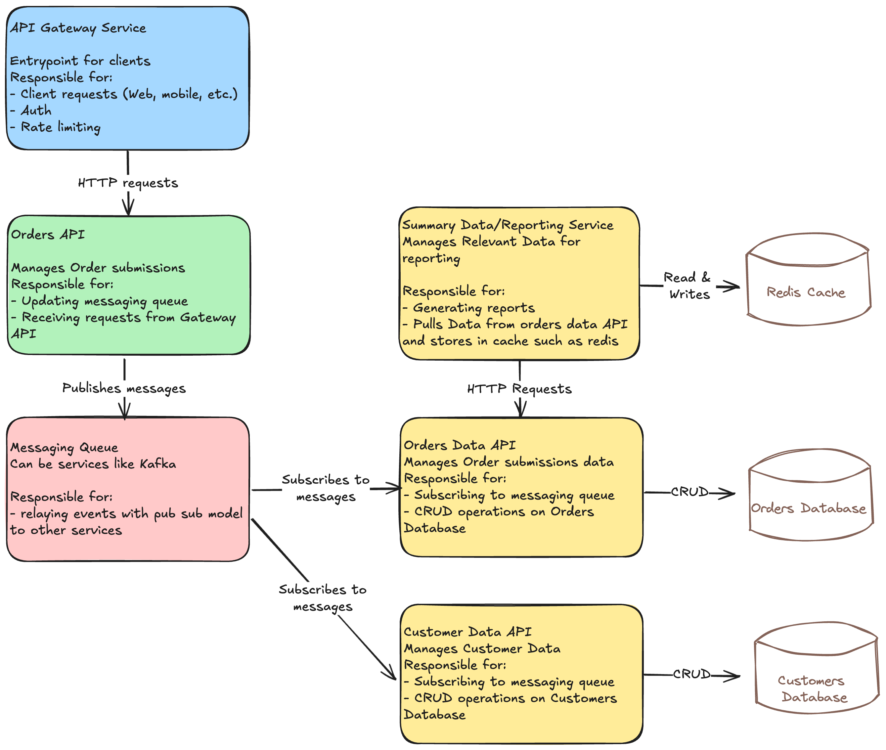

# Qlik Orders

Qlik Orders is a Go-based application designed to manage and summarize customer orders. This application provides a RESTful API for adding orders and retrieving customer-specific items and summaries of total spending.

## Table of Contents

- [Architecture Proposal](#architecture-proposal)
- [Features](#features)
- [Getting Started](#getting-started)
   - [Prerequisites](#prerequisites)
   - [Installation](#installation)
   - [Running Local](#running-local)
   - [Testing](#testing)
- [API Endpoints](#api-endpoints)

## Architecture Proposal

This document describes the high-level architecture for a distributed order management system. Each service is responsible for a distinct set of functionalities, enabling scalability, reliability, and clear separation of concerns.

### Diagram


### Services

#### API Gateway Service

- **Purpose**: Acts as the main entry point for all client requests, whether from web, mobile, or other interfaces.
- **Responsibilities**:
  - Manages and routes incoming client requests.
  - Provides authentication and authorization.
  - Implements rate limiting to control the flow of requests and prevent overload.
- **Communication**:
  - Receives HTTP requests from clients.
  - Forwards requests to the appropriate backend services, such as the Orders API.

---

#### Orders API

- **Purpose**: Handles and manages all order-related submissions and operations.
- **Responsibilities**:
  - Accepts requests from the API Gateway to add or manage orders.
  - Publishes messages to a messaging queue to notify other services about new orders.
- **Communication**:
  - Receives HTTP requests from the API Gateway.
  - Publishes messages to the Messaging Queue for asynchronous communication with other services.

---

#### Messaging Queue

- **Purpose**: Provides a centralized messaging hub for reliable communication between services.
- **Responsibilities**:
  - Implements a pub/sub (publish/subscribe) model to relay messages to subscribed services.
  - Supports services like Kafka to ensure durability and fault tolerance.
- **Communication**:
  - Receives messages from the Orders API.
  - Delivers messages to the Orders Data API, Customer Data API, and other subscribed services.

---

#### Orders Data API

- **Purpose**: Stores and manages order data, providing persistent storage and data access.
- **Responsibilities**:
  - Subscribes to messages from the Messaging Queue to receive new order updates.
  - Performs CRUD operations on the Orders Database for order data management.
- **Communication**:
  - Receives messages from the Messaging Queue.
  - Performs database operations on the Orders Database.
  - Responds to HTTP requests for order data from other services, such as the Summary Data/Reporting Service.

---

#### Customer Data API

- **Purpose**: Manages customer information, ensuring data consistency and accessibility.
- **Responsibilities**:
  - Subscribes to the Messaging Queue to receive and act on relevant events.
  - Performs CRUD operations on the Customers Database to keep customer data up-to-date.
- **Communication**:
  - Receives messages from the Messaging Queue.
  - Performs database operations on the Customers Database.

---

#### Summary Data/Reporting Service

- **Purpose**: Generates and serves summarized data and reports, optimizing data access and query performance.
- **Responsibilities**:
  - Pulls data from the Orders Data API to generate reports on total spending and items purchased.
  - Caches frequently accessed data in Redis to reduce load on primary

---

## Features

- Add a batch of customer orders.
- Retrieve items for a specific customer.
- Get summaries of total spending and number of items purchased by all customers.

## Getting Started

### Prerequisites

- Go v1.23.2

### Installation

1. Clone the repository:

   ```bash
   git clone https://github.com/nighthee/qlikOrders
   cd qlikOrders
   ```

### Running local

1. From the root directory build the executable with:
   
   ```bash
   go build ./cmd/app
   ```

2. Run with:
   
   ```bash
   go run ./app
   ```

### Testing

All tests can be run with `go test -v ./...` from the root of the directory.

## API Endpoints

1. `POST localhost:8080/orders` posts order data

Example:

   ```bash
      curl --location 'localhost:8080/orders' \
      --header 'Content-Type: application/json' \
      --data '[
         {
            "customerId": "01",
            "orderId": "100",
            "timestamp": "1637245070513",
            "items": [
                  {
                     "itemId": "item1",
                     "costEur": 10
                  },
                  {
                     "itemId": "item2",
                     "costEur": 5
                  }
            ]
         },
         {
            "customerId": "02",
            "orderId": "200",
            "timestamp": "1637245070533",
            "items": [
                  {
                     "itemId": "item3",
                     "costEur": 20
                  }
            ]
         }
      ]
      '
   ```


2. `GET localhost:8080/summary` summarizes all the orders for all the customers
Example:
   ```bash
   curl --location 'localhost:8080/summary' \
   --data ''
   ```

3. `GET localhost:8080/customer/:customerid/items` get all the items that the specified customer has ordered
Example:
   ```bash
   curl --location 'localhost:8080/customer/01/items'
   ```